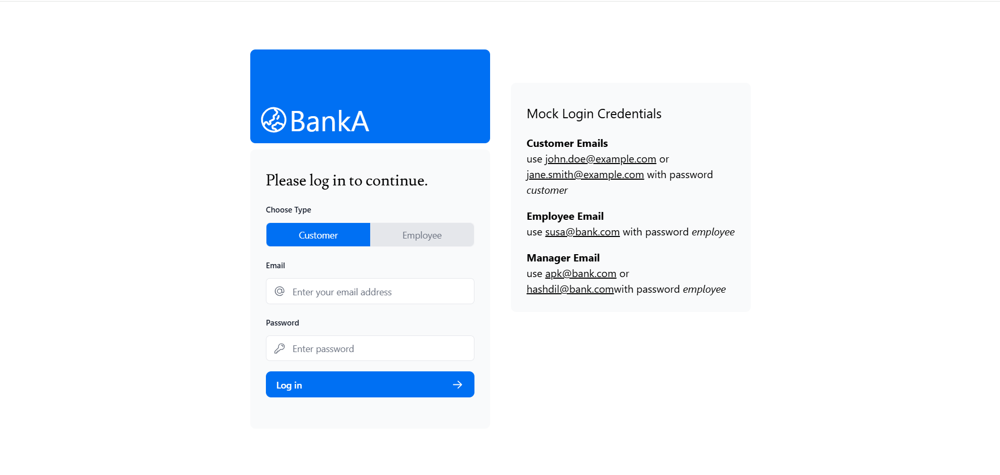
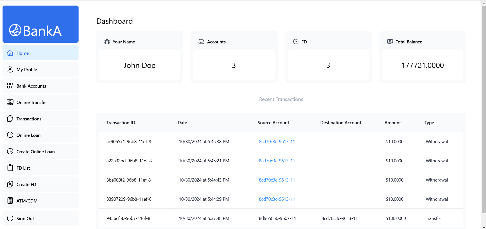
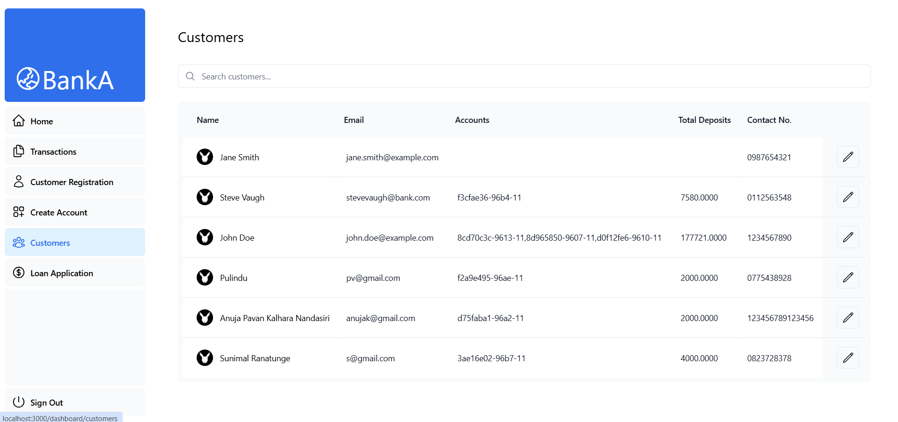
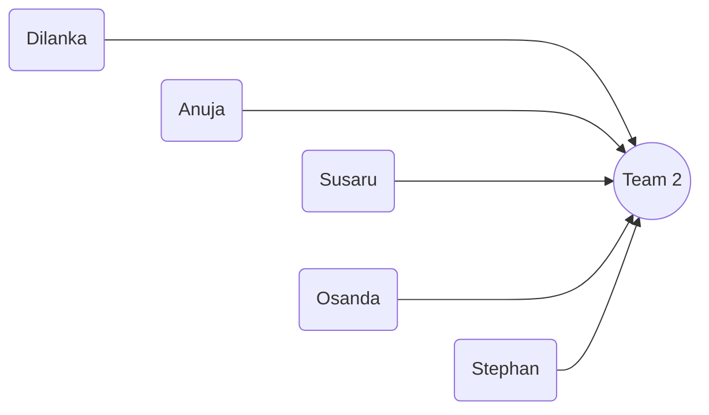

# Welcome to Bank A Repo!





Hi! This is the official repository holding valuable code of **Bank A** website.

## Steps to Run

1. Clone this repo to your local workspace

```bash

git clone https://github.com/AnujaKalahara99/dbms_bankA.git

```

2. use[`pnpm`](https://pnpm.io/) as your package manager, as it's faster and more efficient than `npm` or `yarn`. If you don't have `pnpm` installed, you can install it globally by running

```

npm install -g pnpm

```

- You may have to change Execution Policy for pnpm to function properly

```bash
Get-ExecutionPolicy
Set-ExecutionPolicy RemoteSigned -Scope CurrentUser
```

3. Go to the root folder using terminal (in vs code)

```bash

cd nextjs-bank

```

4. Install any extra packages using

```

pnpm install

```

5. Create MySql Database using workbench and run the [DB_DUMP](./DBDUMP.md) or find the sql dumpfile in root folder

6. Create .env in the root folder of your project and enter the following details

```

MYSQL_HOST=where_you_host_database,_probably_localhost

MYSQL_USER=user_of_your_databse,_probably_root

MYSQL_PASSWORD=password_of_user

MYSQL_DB=bank_project_DB_Schema_name


AUTH_SECRET=DBMS123

AUTH_URL=http://localhost:3000/api/auth
```

7. Run the code in dev mode

```
pnpm run dev
```

## Why NextJS is better

- **File-Based Routing**: Next.js simplifies routing with a file-based system. By placing files in the `pages` directory, developers can quickly set up routes without configuring a separate router.

- **API Routes**: Next.js allows developers to create API endpoints directly within the application. This eliminates the need for a separate Express.js server for basic API functionalities, streamlining development.

- **Optimized Performance**: Next.js automatically optimizes assets and provides features like code splitting and image optimization, leading to faster load times and a better user experience.

- **Easy Deployment**: Hosting Next.js applications is straightforward, especially with platforms like Vercel, which offer seamless integration and automatic scaling.

- **Rich Ecosystem**: Next.js benefits from the extensive React ecosystem, allowing developers to leverage a wide range of libraries and tools while enjoying additional features specific to Next.js.

## We are Team 2!


