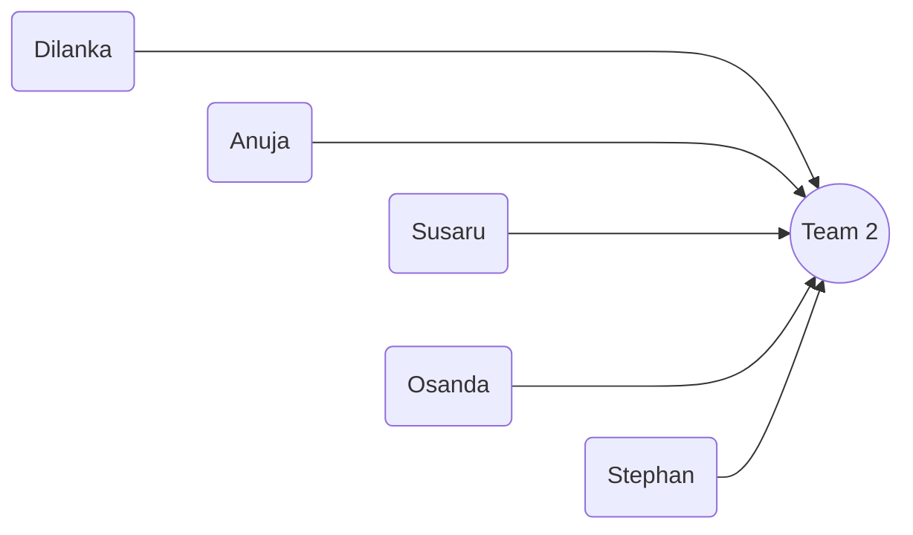

# Welcome to Bank A Repo!

Hi! This is the official repository holding valuable code of **Bank A** website.

## Steps to Run

1. Clone this repo to your local workspace

```bash

git clone https://github.com/AnujaKalahara99/dbms_bankA.git

```

2. use[`pnpm`](https://pnpm.io/) as your package manager, as it's faster and more efficient than `npm` or `yarn`. If you don't have `pnpm` installed, you can install it globally by running

```

npm install -g pnpm

```

- You may have to change Execution Policy for pnpm to function properly

```bash
Get-ExecutionPolicy
Set-ExecutionPolicy RemoteSigned -Scope CurrentUser
```

3. Go to the root folder using terminal (in vs code)

```bash

cd nextjs-bank

```

4. Install any extra packages using

```

pnpm install

```

5. Create MySql Database using workbench and run the queries in SQL Queries section

6. Create .env in the root folder of your project and enter the following details

```

MYSQL_HOST=where_you_host_database,_probably_localhost

MYSQL_USER=user_of_your_databse,_probably_root

MYSQL_PASSWORD=password_of_user

MYSQL_DB=bank_project_DB_Schema_name


AUTH_SECRET=SunimalSirgeThatte

AUTH_URL=http://localhost:3000/api/auth
```

7. Run the code in dev mode

pnpm run dev

## SQl Queries

**Create Tables**

```SQL

CREATE TABLE `Customer` (
  `Customer_ID` VARCHAR(16),
  `Name` VARCHAR(100),
  `Address_Line_1` VARCHAR(50),
  `Address_Line_2` VARCHAR(50),
  `City` VARCHAR(20),
  `Phone_Number` VARCHAR(15),
  `Email` VARCHAR(50),
  `Password` VARCHAR(60),
  PRIMARY KEY (`Customer_ID`)
);

CREATE TABLE `Organization` (
  `Customer_ID` VARCHAR(16),
  `Registration Number` VARCHAR(10),
  `Registration Date` DATE,
  PRIMARY KEY (`Customer_ID`)
);

CREATE TABLE `Personal` (
  `Customer_ID` VARCHAR(16),
  `NIC` VARCHAR(10),
  `Date of Birth` DATE,
  PRIMARY KEY (`Customer_ID`)
);

CREATE TABLE `Plan_Type` (
  `Plan_ID` VARCHAR(5),
  `Plan_Name` VARCHAR(50),
  `Intrest_Rate` DECIMAL(6,4),
  PRIMARY KEY (`Plan_ID`)
);

CREATE TABLE `Saving_Account` (
  `Acount_ID` VARCHAR(16),
  `Remaining_Withdrawals` INT,
  `Plan_ID` VARCHAR(5),
  PRIMARY KEY (`Acount_ID`),
  FOREIGN KEY (`Plan_ID`) REFERENCES `Plan_Type`(`Plan_ID`)
);

CREATE TABLE `FD_Plan` (
  `FD_Plan_ID` VARCHAR(5),
  `Period_in_Months` INT,
  `Intrest_Rate` DECIMAL(6,4),
  PRIMARY KEY (`FD_Plan_ID`)
);

CREATE TABLE `FD` (
  `FD_ID` VARCHAR(16),
  `Account_ID` VARCHAR(16),
  `Amount` DECIMAL(20,4),
  `Start_Date` DATE,
  `FD_Plan_ID` VARCHAR(5),
  PRIMARY KEY (`FD_ID`),
  FOREIGN KEY (`Account_ID`) REFERENCES `Saving_Account`(`Acount_ID`),
  FOREIGN KEY (`FD_Plan_ID`) REFERENCES `FD_Plan`(`FD_Plan_ID`)
);

CREATE TABLE `Online_Loan` (
  `Loan_ID` VARCHAR(16),
  `Fixed_Deposite_ID` VARCHAR(16),
  PRIMARY KEY (`Loan_ID`),
  FOREIGN KEY (`Fixed_Deposite_ID`) REFERENCES `FD`(`FD_ID`)
);

CREATE TABLE `Branch` (
  `Name` VARCHAR(100),
  `Location` VARCHAR(250),
  `Branch_ID` VARCHAR(10),
  `Manager_ID` VARCHAR(10),
  PRIMARY KEY (`Branch_ID`)
);

CREATE TABLE `Account` (
  `Account_ID` VARCHAR(16),
  `Balance` DECIMAL(20,4),
  `Branch_ID` VARCHAR(10),
  `Customer_ID` VARCHAR(16),
  `Account_Type` ENUM("Saving" , "Current"),
  PRIMARY KEY (`Account_ID`),
  FOREIGN KEY (`Branch_ID`) REFERENCES `Branch`(`Branch_ID`),
  FOREIGN KEY (`Customer_ID`) REFERENCES `Customer`(`Customer_ID`)
);

CREATE TABLE `Loan` (
  `Loan_ID` VARCHAR(16),
  `Amount` DECIMAL(20,4),
  `Interest_Rate` DECIMAL(6,4),
  `Issued_Date` DATE,
  `Duration_in_Months` INT,
  `Status` ENUM("Active","Settled" ,"Bad-Debt"),
  `Acount_ID` VARCHAR(16),
  PRIMARY KEY (`Loan_ID`),
  FOREIGN KEY (`Acount_ID`) REFERENCES `Account`(`Account_ID`)
);

CREATE TABLE `Employee` (
  `Name` VARCHAR(100),
  `Employee _ID` VARCHAR(10),
  `Address_Line_1` VARCHAR(50),
  `Address_Line_2` VARCHAR(50),
  `City` VARCHAR(20),
  `Phone_Number` VARCHAR(15),
  `Email` VARCHAR(50),
  `NIC` VARCHAR(10),
  `Branch_ID` VARCHAR(10),
  `Password` VARCHAR(60),
  PRIMARY KEY (`Employee _ID`),
  FOREIGN KEY (`Branch_ID`) REFERENCES `Branch`(`Branch_ID`)
);

CREATE TABLE `Manual Loan` (
  `Loan_ID` VARCHAR(16),
  `Status` ENUM("Accept" , "Reject" , "Pending"),
  `Employee_ID` VARCHAR(10),
  PRIMARY KEY (`Loan_ID`),
  FOREIGN KEY (`Employee_ID`) REFERENCES `Employee`(`Employee _ID`)
);

CREATE TABLE `Loan_Installment` (
  `Instalment_ID` VARCHAR(16),
  `Due_Date` DATE,
  `Amount` DECIMAL(20,4),
  `Loan_ID` VARCHAR(16),
  PRIMARY KEY (`Instalment_ID`),
  FOREIGN KEY (`Loan_ID`) REFERENCES `Loan`(`Loan_ID`)
);

CREATE TABLE `Transaction` (
  `Transaction_ID` VARCHAR(20),
  `Source_Account_ID` VARCHAR(16),
  `Destination_Account_ID` VARCHAR(16),
  `Date_and_Time` TIMESTAMP,
  `Amount` DECIMAL(20,4),
  `Type` ENUM("Deposit" , "Withdrawal" , "Loan-Payment" , "Interest-Rate", "Transfer", "FD", "Loan"),
  `Description` VARCHAR(100),
  `Branch_ID` VARCHAR(10),
  PRIMARY KEY (`Transaction_ID`),
  FOREIGN KEY (`Source_Account_ID`) REFERENCES `Account`(`Account_ID`),
  FOREIGN KEY (`Branch_ID`) REFERENCES `Branch`(`Branch_ID`),
  FOREIGN KEY (`Destination_Account_ID`) REFERENCES `Account`(`Account_ID`)
);

-- Alter Customer table to make Email and Phone_Number unique
ALTER TABLE `Customer`
ADD CONSTRAINT `unique_email_customer` UNIQUE (`Email`),
ADD CONSTRAINT `unique_phone_customer` UNIQUE (`Phone_Number`);

-- Alter Employee table to make Email, Phone_Number, and NIC unique
ALTER TABLE `Employee`
ADD CONSTRAINT `unique_email_employee` UNIQUE (`Email`),
ADD CONSTRAINT `unique_phone_employee` UNIQUE (`Phone_Number`),
ADD CONSTRAINT `unique_nic_employee` UNIQUE (`NIC`);

-- Alter Personal table to make NIC unique
ALTER TABLE `Personal`
ADD CONSTRAINT `unique_nic_personal` UNIQUE (`NIC`);

```

**Insert Mock Data**

```SQL

-- Insert into Customer Table
INSERT INTO `Customer` (`Customer_ID`, `Name`, `Address_Line_1`, `Address_Line_2`, `City`, `Phone_Number`, `Email`, `Password`) VALUES
(1003, 'John Doe', '12 Elm St', 'Apartment 4B', 'Capital City', '555-1234', 'john.doe@example.com', '$2b$10$o/CwJcYL0SbU71ZKpI2I7eQRg4W8VCjFbmvy..WFMYyodOZAZmoJm'),
(1004, 'Jane Smith', '34 Oak St', '', 'Outer Town', '555-5678', 'jane.smith@example.com', '$2b$10$o/CwJcYL0SbU71ZKpI2I7eQRg4W8VCjFbmvy..WFMYyodOZAZmoJm'),
(1001, 'Mark Traders', '22 Maple Ave', 'Unit 12', 'Uptown', '555-9876', 'mark.traders@example.com', '$2b$10$o/CwJcYL0SbU71ZKpI2I7eQRg4W8VCjFbmvy..WFMYyodOZAZmoJm'),
(1002, 'Emily Tailors', '44 Birch Blvd', '', 'Midtown', '555-3456', 'emily.tailors@example.com', '$2b$10$o/CwJcYL0SbU71ZKpI2I7eQRg4W8VCjFbmvy..WFMYyodOZAZmoJm');

-- Insert into Organization Table
INSERT INTO `Organization` (`Customer_ID`, `Registration Number`, `Registration Date`) VALUES
(1001, '123456', '2022-05-20'),
(1002, '654321', '2023-07-15');

-- Insert into Personal Table
INSERT INTO `Personal` (`Customer_ID`, `NIC`, `Date of Birth`) VALUES
(1003, 'NIC001', '1990-01-15'),
(1004, 'NIC002', '1985-09-30');

-- Insert into Plan_Type Table
INSERT INTO `Plan_Type` (`Plan_ID`, `Plan_Name`, `Intrest_Rate`) VALUES
(1, 'Basic Savings Plan', 0.0250),
(2, 'Premium Savings Plan', 0.0350);

-- Insert into Saving_Account Table
INSERT INTO `Saving_Account` (`Acount_ID`, `Remaining_Withdrawals`, `Plan_ID`) VALUES
(1001, 5, 1),
(1002, 10, 2),
(1003, 7, 1),
(1004, 15, 2);

-- Insert into FD_Plan Table
INSERT INTO `FD_Plan` (`FD_Plan_ID`, `Period_in_Months`, `Intrest_Rate`) VALUES
(1, 12, 0.0450),
(2, 24, 0.0500);

-- Insert into FD Table
INSERT INTO `FD` (`FD_ID`, `Account_ID`, `Amount`, `Start_Date`, `FD_Plan_ID`) VALUES
(2001, 1001, 10000.0000, '2023-01-15', 1),
(2002, 1002, 20000.0000, '2023-02-01', 2);

-- Insert into Online_Loan Table
INSERT INTO `Online_Loan` (`Loan_ID`, `Fixed_Deposite_ID`) VALUES
(3001, 2001),
(3002, 2002);

-- Insert into Branch Table
INSERT INTO `Branch` (`Name`, `Location`, `Branch_ID`, `Manager_ID`) VALUES
('Capital City Branch', '12 Main St, Capital City', 1, 5001),
('Outer Town Branch', '56 Park Ave, Outer Town', 2, 5002);

-- Insert into Account Table
INSERT INTO `Account` (`Account_ID`, `Balance`, `Branch_ID`, `Customer_ID`, `Account_Type`) VALUES
(1001, 5000.0000, 1, 1001, 'Saving'),
(1002, 15000.0000, 2, 1002, 'Current'),
(1003, 7500.0000, 1, 1003, 'Saving'),
(1004, 12500.0000, 2, 1004, 'Current');

-- Insert into Loan Table
INSERT INTO `Loan` (`Loan_ID`, `Amount`, `Interest_Rate`, `Issued_Date`, `Duration_in_Months`, `Status`, `Acount_ID`) VALUES
(4001, 5000.0000, 0.0700, '2023-06-10', 12, 'Active', 1001),
(4002, 15000.0000, 0.0650, '2023-05-05', 24, 'Settled', 1002);

-- Insert into Employee Table
INSERT INTO `Employee` (`Name`, `Employee _ID`, `Address_Line_1`, `Address_Line_2`, `City`, `Phone_Number`, `Email`, `NIC`, `Branch_ID`, `Password`) VALUES
('Alice Green', 5001, '78 Pine St', '', 'Capital City', '555-0001', 'alice.green@example.com', 'NIC123456', 1, '$2b$10$iwcwD3KhmgRRMGBRCqm8XOb3Tz/f/SQOqit0mhjwrJf0MSfzAONi.'),
('Bob Brown', 5002, '56 Cedar Ave', '', 'Outer Town', '555-0002', 'bob.brown@example.com', 'NIC654321', 2, '$2b$10$iwcwD3KhmgRRMGBRCqm8XOb3Tz/f/SQOqit0mhjwrJf0MSfzAONi.');

-- Insert into Manual Loan Table
INSERT INTO `Manual Loan` (`Loan_ID`, `Status`, `Employee_ID`) VALUES
(4001, 'Pending', 5001),
(4002, 'Accept', 5002);

-- Insert into Loan_Installment Table
INSERT INTO `Loan_Installment` (`Instalment_ID`, `Due_Date`, `Amount`, `Loan_ID`) VALUES
(6001, '2023-07-10', 500.0000, 4001),
(6002, '2023-08-10', 500.0000, 4001);

-- Insert into Transaction Table
INSERT INTO `Transaction` (`Transaction_ID`, `Source_Account_ID`, `Destination_Account_ID`, `Date_and_Time`, `Amount`, `Type`, `Description`, `Branch_ID`) VALUES
(7001, 1001, 1002, '2023-07-01 10:00:00', 1000.0000, 'Transfer', 'Monthly transfer', 1),
(7002, 1002, 1001, '2023-08-01 11:00:00', 500.0000, 'Loan-Payment', 'Loan payment', 2);

```

## Why NextJS is better

- **File-Based Routing**: Next.js simplifies routing with a file-based system. By placing files in the `pages` directory, developers can quickly set up routes without configuring a separate router.

- **API Routes**: Next.js allows developers to create API endpoints directly within the application. This eliminates the need for a separate Express.js server for basic API functionalities, streamlining development.

- **Optimized Performance**: Next.js automatically optimizes assets and provides features like code splitting and image optimization, leading to faster load times and a better user experience.

- **Easy Deployment**: Hosting Next.js applications is straightforward, especially with platforms like Vercel, which offer seamless integration and automatic scaling.

- **Rich Ecosystem**: Next.js benefits from the extensive React ecosystem, allowing developers to leverage a wide range of libraries and tools while enjoying additional features specific to Next.js.

## We are Team 2!


