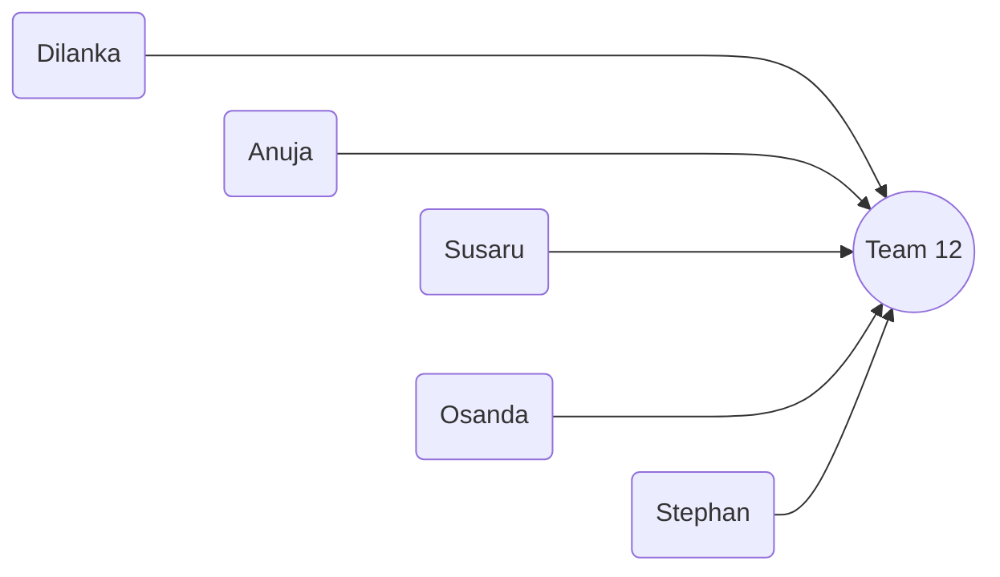

# Welcome to Bank A Repo!

Hi! This is the official repository holding valuable code of **Bank A** website.

## Steps to Run

1.  Clone this repo to your local workspace

    ```bash
    git clone https://github.com/AnujaKalahara99/dbms_bankA.git
    ```

2.  use[`pnpm`](https://pnpm.io/) as your package manager, as it's faster and more efficient than `npm` or `yarn`. If you don't have `pnpm` installed, you can install it globally by running

    ```
    npm install -g pnpm
    ```

3.  Go to the root folder using terminal (in vs code)

    ```bash
    cd nextjs-bank
    ```

4.  Install any extra packages using

    ```
    pnpm install
    ```

5.  Create MySql Database using workbench and run the queries in SQL Queries section
6.  Create .env in the root folder of your project and enter the following details

    ```
    MYSQL_HOST=where_you_host_database,_probably_localhost
    MYSQL_USER=user_of_your_databse,_probably_root
    MYSQL_PASSWORD=password_of_user
    MYSQL_DB=bank_project_DB_Schema_name
    ```

7.  Run the code in dev mode

    pnpm run dev

## SQl Queries

**Create Tables**

```SQL
CREATE TABLE `Branch` (
  `Name` VARCHAR(100),
  `Location` VARCHAR(250),
  `Branch_ID` VARCHAR(50),
  PRIMARY KEY (`Branch_ID`)
);

CREATE TABLE `Manual Loan` (
  `Loan_ID` VARCHAR(50),
  `Status` VARCHAR(20),
  `Branch_ID` VARCHAR(50),
  `Employee_ID` VARCHAR(50),
  PRIMARY KEY (`Loan_ID`)
);

CREATE TABLE `Customer` (
  `Customer_ID` VARCHAR(50),
  `Name` VARCHAR(100),
  `Address_Line_1` VARCHAR(100),
  `Address_Line_2` VARCHAR(100),
  `City` VARCHAR(50),
  `Phone_Number` VARCHAR(20),
  `Email` VARCHAR(100),
  `Password` VARCHAR(60),
  PRIMARY KEY (`Customer_ID`)
);

CREATE TABLE `Account` (
  `Account_ID` VARCHAR(50),
  `Balance` DECIMAL(20,2),
  `Branch_ID` VARCHAR(50),
  `Customer_ID` VARCHAR(50),
  PRIMARY KEY (`Account_ID`),
  FOREIGN KEY (`Branch_ID`) REFERENCES `Branch`(`Branch_ID`),
  FOREIGN KEY (`Customer_ID`) REFERENCES `Customer`(`Customer_ID`)
);

CREATE TABLE `Loan` (
  `Loan_ID` VARCHAR(50),
  `Amount` DECIMAL(20,2),
  `Interest_Rate` DECIMAL(5,2),
  `Issued_Date` DATE,
  `Duration_From_Months` INT,
  `Customer_ID` VARCHAR(50),
  `Acount_ID` VARCHAR(50),
  PRIMARY KEY (`Loan_ID`),
  FOREIGN KEY (`Acount_ID`) REFERENCES `Account`(`Account_ID`)
);

CREATE TABLE `Loan_Installment` (
  `Instalment_ID` VARCHAR(50),
  `Due_Date` DATE,
  `Amount` DECIMAL(10,2),
  `Status` VARCHAR(20),
  `Loan_ID` VARCHAR(50),
  PRIMARY KEY (`Instalment_ID`),
  FOREIGN KEY (`Loan_ID`) REFERENCES `Loan`(`Loan_ID`)
);

CREATE TABLE `Transaction` (
  `Transaction_ID` VARCHAR(50),
  `Source_Account_ID` VARCHAR(50),
  `Destination_Account_ID` VARCHAR(50),
  `Date` DATE,
  `Time` TIME,
  `Amount` DECIMAL(10,2),
  `Type` VARCHAR(50),
  `Branch_ID` VARCHAR(50),
  PRIMARY KEY (`Transaction_ID`),
  FOREIGN KEY (`Source_Account_ID`) REFERENCES `Account`(`Account_ID`),
  FOREIGN KEY (`Branch_ID`) REFERENCES `Branch`(`Branch_ID`),
  FOREIGN KEY (`Destination_Account_ID`) REFERENCES `Account`(`Account_ID`)
);

CREATE TABLE `Plan_Type` (
  `Plan_ID` VARCHAR(50),
  `Plan_Name` VARCHAR(100),
  `Intrest_Rate` DECIMAL(5,2),
  PRIMARY KEY (`Plan_ID`)
);

CREATE TABLE `Saving_Account` (
  `Acount_ID` VARCHAR(50),
  `Remaining_Withdrawals` INT,
  `Plan_ID` VARCHAR(50),
  PRIMARY KEY (`Acount_ID`),
  FOREIGN KEY (`Plan_ID`) REFERENCES `Plan_Type`(`Plan_ID`)
);

CREATE TABLE `FD_Period` (
  `Period` VARCHAR(20),
  `Intrest_Rate` DECIMAL(5,2),
  PRIMARY KEY (`Period`)
);

CREATE TABLE `FD` (
  `FD_ID` VARCHAR(50),
  `Account_ID` VARCHAR(50),
  `Amount` DECIMAL(20,2),
  `Start_Date` DATE,
  `Period` VARCHAR(20),
  PRIMARY KEY (`FD_ID`),
  FOREIGN KEY (`Account_ID`) REFERENCES `Saving_Account`(`Acount_ID`),
  FOREIGN KEY (`Period`) REFERENCES `FD_Period`(`Period`)
);

CREATE TABLE `Online_Loan` (
  `Loan_ID` VARCHAR(50),
  `Fixed_Deposite_ID` VARCHAR(50),
  PRIMARY KEY (`Loan_ID`),
  FOREIGN KEY (`Fixed_Deposite_ID`) REFERENCES `FD`(`FD_ID`)
);

CREATE TABLE `Employee` (
  `Name` VARCHAR(100),
  `Employee_ID` VARCHAR(50),
  `Address_Line_1` VARCHAR(100),
  `Address_Line_2` VARCHAR(100),
  `City` VARCHAR(50),
  `Phone_Number` VARCHAR(20),
  `Email` VARCHAR(100),
  `NIC` VARCHAR(50),
  `Branch_ID` VARCHAR(50),
  `Is_Manager` BOOL,
  `Password` VARCHAR(60),
  PRIMARY KEY (`Employee _ID`),
  FOREIGN KEY (`Branch_ID`) REFERENCES `Branch`(`Branch_ID`)
);

CREATE TABLE `Current_Acount` (
  `Acount_ID` VARCHAR(50),
  PRIMARY KEY (`Acount_ID`)
);

CREATE TABLE `Personal` (
  `Customer_ID` VARCHAR(50),
  `NIC` VARCHAR(50),
  `Date of Birth` DATE,
  PRIMARY KEY (`Customer_ID`)
);

CREATE TABLE `Organization` (
  `Customer_ID` VARCHAR(50),
  `Registration Number` INT,
  `Registration Date` DATE,
  PRIMARY KEY (`Customer_ID`)
);

CREATE TABLE `Configurations` (
  `Online Loan Upper Bound` INT,
  `Online Loan Max Percentage` INT,
  `Savings Account Max Withdrawal Count` INT
);
```

**Insert Mock Data**

```SQL
-- Insert into Branch Table
INSERT INTO `Branch` (`Name`, `Location`, `Branch_ID`) VALUES
('Main Branch', '123 Main St, Capital City', 'BR001'),
('Sub Branch', '456 Suburb Ave, Outer Town', 'BR002');

-- Insert into Customer Table
INSERT INTO `Customer` (`Customer_ID`, `Name`, `Address_Line_1`, `Address_Line_2`, `City`, `Phone_Number`, `Email`, `Password`) VALUES
('CUST001', 'John Doe', '12 Elm St', 'Apartment 4B', 'Capital City', '555-1234', 'john.doe@example.com', '$2b$10$o/CwJcYL0SbU71ZKpI2I7eQRg4W8VCjFbmvy..WFMYyodOZAZmoJm'),
('CUST002', 'Jane Smith', '34 Oak St', '', 'Outer Town', '555-5678', 'jane.smith@example.com', '$2b$10$o/CwJcYL0SbU71ZKpI2I7eQRg4W8VCjFbmvy..WFMYyodOZAZmoJm');

-- Insert into Employee Table
INSERT INTO `Employee` (`Name`, `Employee _ID`, `Address_Line_1`, `Address_Line_2`, `City`, `Phone_Number`, `Email`, `NIC`, `Branch_ID`, `Is_Manager`, `Password`) VALUES
('Alice Green', 'EMP001', '78 Pine St', '', 'Capital City', '555-0001', 'alice.green@example.com', 'NIC123456', 'BR001', TRUE, '$2b$10$iwcwD3KhmgRRMGBRCqm8XOb3Tz/f/SQOqit0mhjwrJf0MSfzAONi.'),
('Bob Brown', 'EMP002', '56 Cedar Ave', '', 'Outer Town', '555-0002', 'bob.brown@example.com', 'NIC654321', 'BR002', FALSE, '$2b$10$iwcwD3KhmgRRMGBRCqm8XOb3Tz/f/SQOqit0mhjwrJf0MSfzAONi.');

-- Insert into Account Table
INSERT INTO `Account` (`Account_ID`, `Balance`, `Branch_ID`, `Customer_ID`) VALUES
('ACC001', 10000.50, 'BR001', 'CUST001'),
('ACC002', 2500.75, 'BR002', 'CUST002');

-- Insert into Loan Table
INSERT INTO `Loan` (`Loan_ID`, `Amount`, `Interest_Rate`, `Issued_Date`, `Duration_From_Months`, `Customer_ID`, `Acount_ID`) VALUES
('LN001', 5000.00, 5.00, '2024-01-15', 24, 'CUST001', 'ACC001'),
('LN002', 7500.00, 4.50, '2023-12-10', 36, 'CUST002', 'ACC002');

-- Insert into Loan Installment Table
INSERT INTO `Loan_Installment` (`Instalment_ID`, `Due_Date`, `Amount`, `Status`, `Loan_ID`) VALUES
('INST001', '2024-02-15', 250.00, 'Pending', 'LN001'),
('INST002', '2024-03-15', 250.00, 'Pending', 'LN001'),
('INST003', '2024-02-10', 200.00, 'Paid', 'LN002');

-- Insert into Transaction Table
INSERT INTO `Transaction` (`Transaction_ID`, `Source_Account_ID`, `Destination_Account_ID`, `Date`, `Time`, `Amount`, `Type`, `Branch_ID`) VALUES
('TR001', 'ACC001', 'ACC002', '2024-01-25', '14:30:00', 1500.00, 'Transfer', 'BR001'),
('TR002', 'ACC002', 'ACC001', '2024-01-26', '10:15:00', 500.00, 'Transfer', 'BR002');

-- Insert into Plan Type Table
INSERT INTO `Plan_Type` (`Plan_ID`, `Plan_Name`, `Intrest_Rate`) VALUES
('PLAN001', 'Basic Savings Plan', 2.50),
('PLAN002', 'Premium Savings Plan', 3.00);

-- Insert into Saving Account Table
INSERT INTO `Saving_Account` (`Acount_ID`, `Remaining_Withdrawals`, `Plan_ID`) VALUES
('SACC001', 5, 'PLAN001'),
('SACC002', 3, 'PLAN002');

-- Insert into FD Period Table
INSERT INTO `FD_Period` (`Period`, `Intrest_Rate`) VALUES
('6 Months', 3.50),
('12 Months', 4.00);

-- Insert into FD Table
INSERT INTO `FD` (`FD_ID`, `Account_ID`, `Amount`, `Start_Date`, `Period`) VALUES
('FD001', 'SACC001', 2000.00, '2023-07-01', '12 Months'),
('FD002', 'SACC002', 5000.00, '2023-09-01', '6 Months');

-- Insert into Online Loan Table
INSERT INTO `Online_Loan` (`Loan_ID`, `Fixed_Deposite_ID`) VALUES
('LN001', 'FD001'),
('LN002', 'FD002');

-- Insert into Configurations Table
INSERT INTO `Configurations` (`Online Loan Upper Bound`, `Online Loan Max Percentage`, `Savings Account Max Withdrawal Count`) VALUES
(10000, 80, 5);
```

## Why NextJS is better

- **File-Based Routing**: Next.js simplifies routing with a file-based system. By placing files in the `pages` directory, developers can quickly set up routes without configuring a separate router.
- **API Routes**: Next.js allows developers to create API endpoints directly within the application. This eliminates the need for a separate Express.js server for basic API functionalities, streamlining development.
- **Optimized Performance**: Next.js automatically optimizes assets and provides features like code splitting and image optimization, leading to faster load times and a better user experience.
- **Easy Deployment**: Hosting Next.js applications is straightforward, especially with platforms like Vercel, which offer seamless integration and automatic scaling.
- **Rich Ecosystem**: Next.js benefits from the extensive React ecosystem, allowing developers to leverage a wide range of libraries and tools while enjoying additional features specific to Next.js.

## We are Team 12!


